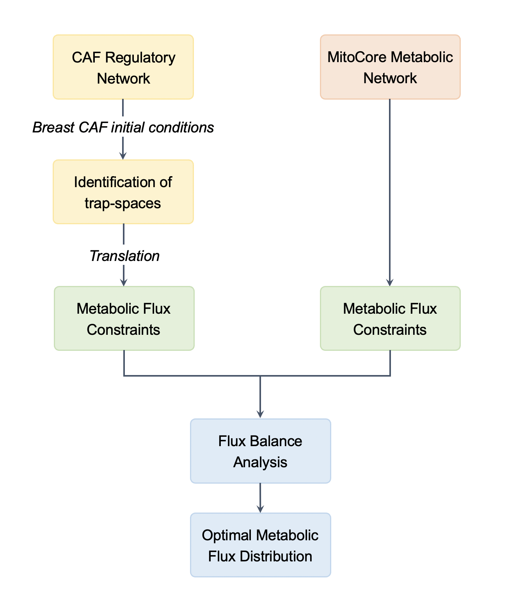

# A large-scale hybrid model to adress reverse Warburg effect in breast cancer-associated fibroblasts

## Scope

This repository summarizes all the codes and data used to generate the results presented in "A large-scale hybrid model to adress reverse Warburg effect in breast cancer-associated fibroblasts". 
The detailed framework is described in [Metabolic reprogramming in Rheumatoid Arthritis Synovial Fibroblasts: A hybrid modeling approach](https://doi.org/10.1371/journal.pcbi.1010408). Please refer to the latter for all information concerning the methods used.

## Description

This repository includes thoroughly annotated Jupyter notebooks and R scripts covering:

1. Differential expression analysis of CAFs-S1 vs. CAFs-S4 RNA-Seq data ([EGAD00001003808](https://ega-archive.org/datasets/EGAD00001003808)) to extract breast CAF-specific initial conditions in order to contextualize the regulatiory model;

2. Framework for generating a hybrid model coupling the asynchronous breast CAF-specific regulatory Boolean network with MitoCore's constraint-based reconstruction of human central metabolism as follows:

3. Identification of regulatory molecular drivers of reverse Warburg effect in breast CAFs through regulatory inputs knock-out/knock-in simulations. 

## Contributors

- Sahar Aghakhani, [sahar.aghakhani@univ-evry.fr](sahar.aghakhani@univ-evry.fr);
- Sacha E Silva-Saffar, [sacha.e-silva-saffar@universite-paris-saclay.fr](sacha.e-silva-saffar@universite-paris-saclay.fr)
- Sylvain Soliman, [sylvain.soliman@inria.fr](sylvain.soliman@inria.fr);
- Anna Niarakis, [anna.niaraki@univ-evry.fr](anna.niaraki@univ-evry.fr).
